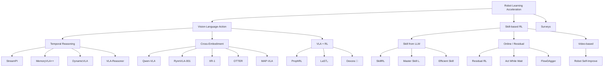

# Taxonomy Tree

> Visual classification of all 27 surveyed papers.

```mermaid
graph TD
    Root[Robot Learning Acceleration] --> VLA[Vision-Language-Action]
    Root --> SRL[Skill-based RL]
    Root --> SUR[Surveys]

    VLA --> TMP[Temporal Reasoning]
    VLA --> CEM[Cross-Embodiment]
    VLA --> HBD[VLA + RL]

    TMP --> S1[StreamPI]
    TMP --> S2[MemoryVLA++]
    TMP --> S3[DynamicVLA]
    TMP --> S4[VLA-Reasoner]

    CEM --> C1[Qwen-VLA]
    CEM --> C2[RynnVLA-001]
    CEM --> C3[XR-1]
    CEM --> C4[OTTER]
    CEM --> C5[MAP-VLA]

    HBD --> H1[ProphRL]
    HBD --> H2[LaST₀]
    HBD --> H3[Dexora 🏅]

    SRL --> LLM[Skill from LLM]
    SRL --> ONL[Online / Residual]
    SRL --> VID[Video-based]

    LLM --> L1[SkillRL]
    LLM --> L2[Master Skill L.]
    LLM --> L3[Efficient Skill]

    ONL --> O1[Residual RL]
    ONL --> O2[Act While Wait]
    ONL --> O3[FlowDAgger]

    VID --> V1[Robot Self-Improve]
```

## Interactive Version

Open **`taxonomy/taxonomy.html`** in your browser for the full interactive SVG version.