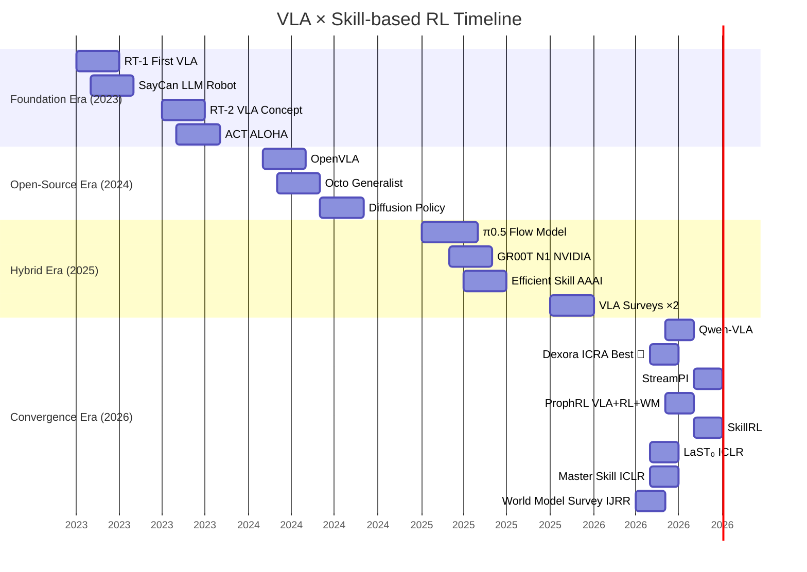

# Technology Evolution Timeline

> Key milestones in VLA and Skill-based RL from 2023 to 2026.

## Key Trend Arrows

| Trend | Trajectory |
|:---|---:|
| 📊 **Temporal** | Single-frame → instruction-anchored → memory + imagination |
| 🔗 **VLA + RL** | Separate → World model bridge → Co-evolution |
| 🎯 **Skill Reuse** | Static library → Retrieval → Recursive co-evolution |
| 🌐 **Embodiment** | Single robot → Cross-embodiment → Unified model |

## Interactive Version

Open **`taxonomy/timeline.html`** in your browser for the full interactive SVG version.